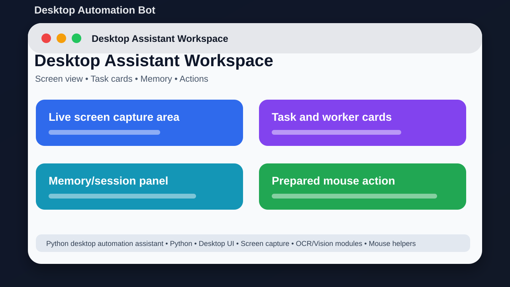
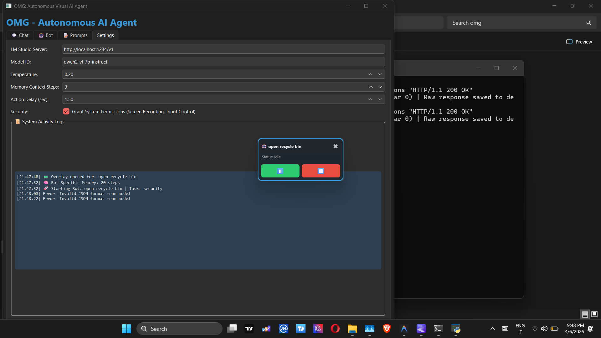

# Desktop Automation Bot



## Short Description

A local desktop assistant experiment that can inspect the screen and prepare actions.

## About This Project

Desktop Automation Bot is a Python desktop automation project. It explores how a local assistant can capture the screen, process images, keep memory, use prompts, and prepare safe mouse actions.

The goal is to keep the project easy to understand, easy to run, and useful for learning or further development.

## Purpose And Idea

**Purpose:** The purpose of this project is to experiment with a local desktop assistant that can look at the screen, understand context, keep memory, and prepare safe mouse actions.

**Idea:** The idea is to make a desktop bot that can help with computer tasks by using screenshots, OCR/vision modules, prompts, memory, and action helpers.

**Why I made it:** I made this to learn how PC automation agents work from the inside: screen capture, prompt handling, memory, logs, and mouse action planning.

## Screenshots

### Real desktop capture



### Project preview


## Main Features

- Desktop dashboard for the bot
- Screenshot capture and preprocessing
- OCR/vision-ready modules
- Agent memory and sessions
- Prompt files for task handling
- Mouse action helper code
- Runtime logs for debugging

## Tech Stack

- Python
- Desktop UI
- Screen capture
- OCR/Vision modules
- Mouse helpers

## Project Location

Main local folder:

```text
D:\PROJECTS\DesktopAutomationBot
```

GitHub repository:

https://github.com/saifalian/DesktopAutomationBot

## Project Structure

```text
actions/       Mouse action helpers
agent/         Bot brain, memory, and sessions
config/        Runtime settings
llm/           Prompt and LLM helper files
ui/            Desktop interface files
vision/        Screenshot and image tools
main.py        App entry point
```

## How To Run

1. Create a Python virtual environment.
2. Install requirements.txt.
3. Run python main.py.
4. Test only on safe windows first.

## Current Status

This project is uploaded to GitHub and prepared as a portfolio-style repository. More improvements can be added later, such as real app screenshots, demo videos, releases, and issue templates.

## Safety Note

Do not let experimental automation control banking, payment, private account, or system settings pages.

## License

No license file is included yet. Add a license before using this project as an open-source project.
